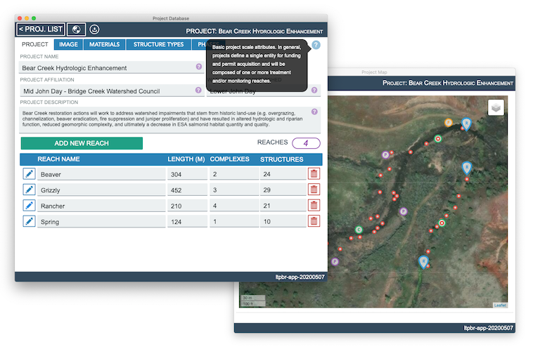

This version of the protocol is being superseded (Summer 2024) by a Version 2, that is more GIS based. That protocol can be implemented with the [Riverscapes Studio (QRiS plugin to QGIS)](https://qris.riverscapes.net). 

# fmLTPBR Database Application

Database management and field data collection solution supporting the Low-Tech Process-Based Restoration Implementation and Monitoring Protocol. At this time, the database application runs on Mac and Windows operating systems within Filemaker Pro Advanced and on mobile devices iOS devices within Filemaker Go for field data colleciton.

## Protocol Scope and Intent

- Present an accessible and flexible set of design attributes and monitoring survey protocols that can be consistently applied to the design, implementation, and monitoring of LT-PBR projects.

- Develop a flexible data collection and project management solution that supports common tasks in proposal development, permit acquisition, and fulfillment of land management agency monitoring and reporting requirements.

- Advance the science and art of LT-PBR practices by encouraging the adoption of a standardized design, monitoring, and approach to the calculation and interpretation of summary metrics that describe project outcomes and effectiveness.

### Actual Protocol
Weber, N., Wathen, G., & Bouwes, N. (2021). Low-Tech Process-Based Restoration - Project Implementation and Monitoring Protocol - Version 1 (1.0). Zenodo. [https://doi.org/10.5281/zenodo.10631553](https://doi.org/10.5281/zenodo.10631553)

## fmLTPBR Database Application

The fmLTPBR database was designed to collect, store, summarize, and disseminate all data requirements within the implementation and monitoring protocol. The database has been designed for use on Windows and Mac operating systems running Filemaker Pro Advanced, and for field data collection on iPads running Filemaker Go.

## Acknowledgements

This draft of the protocol and database application was by a grant supplied by the [Oregon Watershed Enhancement Board](https://www.oregon.gov/oweb/Pages/index.aspx), and coordinated by the Mid-John Day Bridge Creek Watershed Council. The protocol was developed based on the combined input of restoratoin ecologists, geomorphologists, and data scientists from [Anabranch Solutions](www.anabranchsolutions.com), [Eco Logical Research](www.eco-logical.research.com), and [Utah State University](http://etal.joewheaton.org/).
