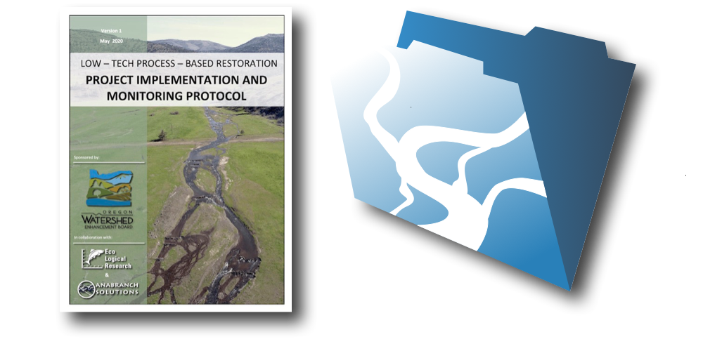

# fmLTPBR Database Application
---

Database management and field data collection solution supporting the Low-Tech Process-Based Restoration Implementation and Monitoring Protocol.

## Protocol Scope and Intent
---

- Present an accessible and flexible set of design attributes and monitoring survey protocols that can be consistently applied to the design, implementation, and monitoring of LT-PBR projects.

- Develop a flexible data collection and project management solution that supports common tasks in proposal development, permit acquisition, and fulfillment of land management agency monitoring and reporting requirements.

- Advance the science and art of LT-PBR practices by encouraging the adoption of a standardized design, monitoring, and approach to the calculation and interpretation of summary metrics that describe project outcomes and effectiveness.

The fmLTPBR database was designed to collect, store, summarize, disseminate all data requirements within the implementation and monitoring protocol. The database has been designed for use on Windows and Mac operating systems running Filemaker Pro Advanced, and for field data collection on iPads running Filemaker Go.

## fmLTPBR Database Application
---

The fmLTPBR database was designed to collect, store, summarize, and disseminate all data requirements within the implementation and monitoring protocol. The database has been designed for use on Windows and Mac operating systems running Filemaker Pro Advanced, and for field data collection on iPads running Filemaker Go.

