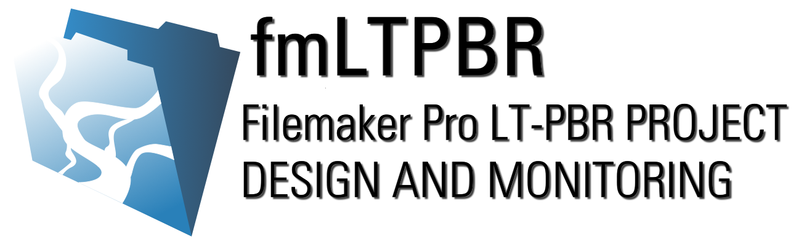

# About fmLTPBR

The fmLTPBR database application supports a set of attributes and survey methods that can be used to facilitate the design, management, and monitoring of process based riverscape restoration projects. The approach draws heavily on the conceptualization of low-tech process-based restoration (LT-PBR) practices developed by [Wheaton and others (2019)](https://lowtechpbr.restoration.usu.edu/) and operationalizes those ideas through development of a unified framework for consistently documenting and presenting restoration information throughout a project lifespan. The protocol has been developed with the following intent:

- Present an accessible and flexible set of design attributes and monitoring survey protocols that can be consistently applied to the design, implementation, and monitoring of LT-PBR projects.

- Develop a flexible data collection and project management solution that supports common tasks in proposal development, permit acquisition, and fulfillment of land management agency monitoring and reporting requirements.

- Advance the science and art of LT-PBR practices by encouraging the adoption of a standardized design, monitoring, and approach to the calculation and interpretation of summary metrics that describe project outcomes and effectiveness.

## Project Resources

Start with the [Learning Resources]({{site.baseurl}}/Learn) to get an introduction to the protocol and the database application. From there you can download the protocol and a blank copy of the database application.

  <a class="button" href="{{ site.baseurl }}/Learn"><i class="fa fa-youtube" aria-hidden="true"></i>  Learning Resources</a>
  <a class="button" href="{{ site.baseurl }}/Protocol"><i class="fa fa-book" aria-hidden="true"></i> Get the Protocol</a>
  <!-- TODO Add the release link on github here. -->
  <a class="button" href="#"><i class="fa fa-database" aria-hidden="true"></i> Get the Database</a>

## Project Vision and Roadmap
Expectations for future releases of the fmLTPBR database application.

| Release   | Timeline   | Release Description   |
| --------- | ------- | ------- |
| **V 1.0.0** | Spring 2020 | Database implementation within Filemaker Pro supporting version 1.0 of the LT-PBR Implementation and Monitoring Protocol |
| **V 2.0.0** | Spring 2022 | Implementation remains in Filemaker Pro but gains some support for data syncronization and cloud storage. Supports extension and refinement of the LT-PBR Implementation and Monitoring Protocol within version 2.0|
| **V 3.0.0** | Spring 2024 | Database application implemented in open source set of technologies that support an increased set of user platforms (i.e., Android, iOS, Mac, Windows) and extended data synchronization and cloud storage functionality. |

## Acknowledgements
This draft of the protocol and database application was by a grant supplied by the [Oregon Watershed Enhancement Board](https://www.oregon.gov/oweb/Pages/index.aspx), and coordinated by the Mid-John Day Bridge Creek Watershed Council. The protocol was developed based on the combined input of restoratoin ecologists, geomorphologists, and data scientists from [Anabranch Solutions](www.anabranchsolutions.com), [Eco Logical Research](www.eco-logical.research.com), and [Utah State University](http://etal.joewheaton.org/).

