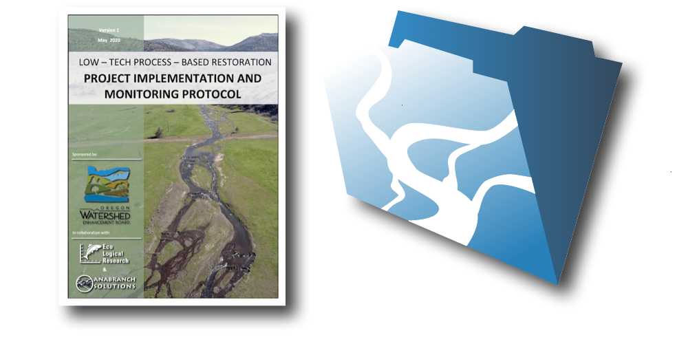
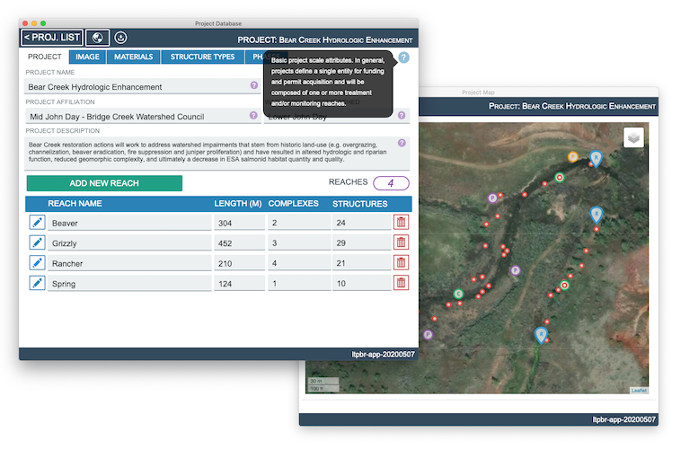

<h1>LTPBR Implementation and Monitoring Protocol</h1>

The Low-Tech Process-Based Restoration Implementation and Monitoring Protocol and database application outline a set of attributes and survey methods used to document the design, implementation, and monitoring of process-based riverscape restoration projects. The approach draws heavily on the conceptualization of low-tech process-based restoration (LT-PBR) practices developed by [Wheaton and others (2019)](https://lowtechpbr.restoration.usu.edu/) and operationalizes those ideas through development of a unified framework for consistently documenting and presenting restoration information throughout a project lifespan.

  

  <a class="button large" href="{{ site.baseurl }}/Learn"><i class="fa fa-youtube" aria-hidden="true"></i>  Learning Resources</a>

<h2>  Protocol Scope and Intent</h2>

- Present an accessible and flexible set of design attributes and monitoring survey protocols that can be consistently applied to the design, implementation, and monitoring of LT-PBR projects.

- Develop a flexible data collection and project management solution that supports common tasks in proposal development, permit acquisition, and fulfillment of land management agency monitoring and reporting requirements.

- Advance the science and art of LT-PBR practices by encouraging the adoption of a standardized design, monitoring, and approach to the calculation and interpretation of summary metrics that describe project outcomes and effectiveness.

  <a class="button large" href="https://github.com/Riverscapes/fmLTPBR/releases/download/v1.0.0/LTPBR-Monitoring-V1.pdf"><i class="fa fa-book" aria-hidden="true"></i> Get the Protocol</a>  

<h2>  fmLTPBR Protocol Database Application</h2>

The fmLTPBR database was designed to collect, store, summarize, and disseminate all data requirements within the implementation and monitoring protocol. The database has been designed for use on Windows and Mac operating systems running Filemaker Pro Advanced, and for field data collection on iPads running Filemaker Go.

  

  <a class="button large" href="https://github.com/Riverscapes/fmLTPBR/releases/download/v1.0.0/fmLTPBR-20200507.fmp12"><i class="fa fa-database" aria-hidden="true"></i> Get the Database</a>

<h2>  Keep Up to Date</h2>

If you would like to be notified about future protocol and database updates please fill out the short form below. Don't worry, we will not share your email, but you may recieve an email from the protocol development team from time to time about new protocol versions, database features, or bug fixes.

  <a class="button large" target="_blank" href="https://docs.google.com/forms/d/e/1FAIpQLScmW3_oIP55FpAEfEN6UDVQFtDiJvhGRvxEMB7SrqZxF6SAxQ/viewform?usp=sf_link"><i class="fa fa-envelope" aria-hidden="true"></i> Keep Me Up to Date</a>

## Project Vision and Roadmap
Expectations for future releases of the fmLTPBR database application.

| Release   | Timeline   | Release Description   |
| --------- | ------- | ------- |
| **V 1.0.0** | Spring 2020 | Database implementation within Filemaker Pro supporting version 1.0 of the LT-PBR Implementation and Monitoring Protocol |
| **V 1.1.0** | Fall 2020 | Export of projects into riverscapes compliant format. Extended database import functionality|
| **V 2.0.0** | Spring 2021 | Implementation remains in Filemaker Pro but gains some support for data syncronization and cloud storage. Supports extension and refinement of the LT-PBR Implementation and Monitoring Protocol within version 2.0|
| **V 3.0.0** | Spring 2023 | Database application implemented in open source set of technologies that support an increased set of user platforms (i.e., Android, iOS, Mac, Windows) and extended data synchronization and cloud storage functionality. |

## Acknowledgements
This draft of the protocol and database application was by a grant supplied by the [Oregon Watershed Enhancement Board](https://www.oregon.gov/oweb/Pages/index.aspx), and coordinated by the Mid-John Day Bridge Creek Watershed Council. The protocol was developed based on the combined input of restoratoin ecologists, geomorphologists, and data scientists from [Anabranch Solutions](www.anabranchsolutions.com), [Eco Logical Research](www.eco-logical.research.com), and [Utah State University](http://etal.joewheaton.org/).

